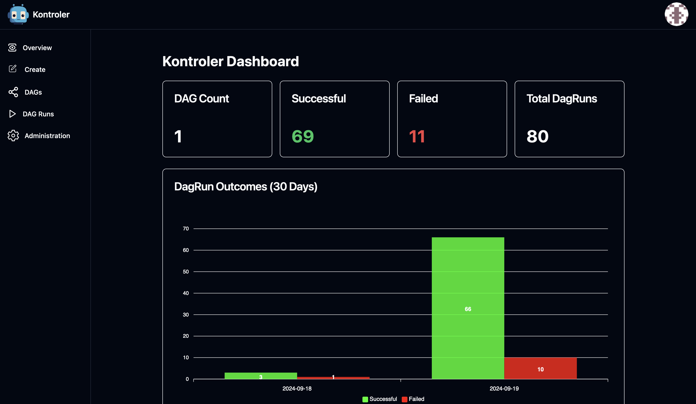

<p align="center">

</p>
<h1 align="center">
    Always in Kontrol
    <p align="center">
        
    </p>
</h1>

# Kontroler

Kontroler is a Kubernetes scheduling engine for managing Directed Acyclic Graphs (DAGs) through cron-based jobs or event-driven execution. 

This system allows for running containers as tasks within a DAG, while providing an optional web-based UI for creating, managing, and visualizing DAG runs. DAGs can be defined using either traditional YAML task arrays or a concise Domain Specific Language (DSL).

<p align="center">

</p>

*Worth noting that as this is alpha still expect multiple breaking changes between version, while there are no real uses of Kontroler there will be no migration scripts between versions*

## Getting Started

### Documentation

The best place to find the most up to date documentation is at our docsite, you can find it at: https://kontroler.dev

### Helm Chart

You can find the unified helm chart under the /helm directory in this repo. The helm chart contains:

* CRDS
* Controller
* Server
* UI

Currently the helm chart leans on cert-manager, there is planned out to de-couple the chart from relying on cert-manager.


## State

Kontroler is in a very early alpha state and if it is used in production expect bugs along with breaking changes coming in future releases.

## Aims of Kontroler

Kontroler aims to provide a way to manage scheduling containers in a simple manner via YAML files.

## Features

Features we are aiming to cover are:

* DAG Execution via CronJobs: Define and schedule your DAGs to run at specified intervals using cron.
* Event-Driven DAGs: Execute DAGs based on external events such as a message from a queue or a webhook trigger.
* Container Support: Easily run any containerized task within your DAG.
* DSL Support: Define DAGs using a clean, expressive Domain Specific Language as an alternative to traditional YAML task arrays.
* Optional UI: A web-based interface is available for creating and viewing DAG runs, simplifying DAG management.
* Optional Server: An included server can be deployed to power the UI, providing a full-featured platform for scheduling tasks.
* Pod Templates: Allows pods to use secrets, pvcs, serviceAccounts, setting affinity along with much more (see the example below for all the options!)


## Server + UI Overview

The Server+UI allows you to:

* Create + Views DAGs: Use the interface to visually create and configure DAGs
* Create + Views DAG Runs: Create & Track the status, success, or failure of DAG runs

Planned Features:

* Trigger DAGs Manually: Execute DAGs directly from the UI
* User Roles: Restrict what a user can do
* Better Password Management: Improve Security/Creation workflow
* Adding mTLS: Server + UI can communicate over mTLS

## Example of DAG

Here are two examples, one event-driven & one that runs on a schedule:

Event Driven
```yaml
apiVersion: kontroler.greedykomodo/v1alpha1
kind: DAG
metadata:
  name: event-driven
spec:
  schedule: ""
  parameters:
    - name: first
      defaultFromSecret: secret-name
    - name: second
      defaultValue: value
  task:
    - name: "random"
      command: ["sh", "-c"]
      args:
        [
          "if [ $((RANDOM%2)) -eq 0 ]; then echo $second; else exit 1; fi",
        ]
      image: "alpine:latest"
      backoff:
        limit: 3
      parameters:
        - second
      conditional:
        enabled: true
        retryCodes: [1]
      podTemplate:
        volumes:
          - name: example-pvc
            persistentVolumeClaim:
              claimName: example-claim  # The name of the PVC
        volumeMounts:
          - name: example-pvc
            mountPath: /data  # Path inside the container where the PVC is mounted
        imagePullSecrets:
          - name: my-registry-secret
        securityContext:
          runAsUser: 1000
          runAsGroup: 3000
          fsGroup: 2000
        nodeSelector:
          disktype: ssd
        tolerations:
          - key: "key1"
            operator: "Equal"
            value: "value1"
            effect: "NoSchedule"
        affinity:
          nodeAffinity:
            requiredDuringSchedulingIgnoredDuringExecution:
              nodeSelectorTerms:
                - matchExpressions:
                    - key: "kubernetes.io/e2e-az-name"
                      operator: In
                      values:
                        - e2e-az1
                        - e2e-az2
        serviceAccountName: "custom-service-account"
        automountServiceAccountToken: false
    - name: "random-b"
      command: ["sh", "-c"]
      args:
        [
          "if [ $((RANDOM%2)) -eq 0 ]; then echo 'Hello, World!'; else exit 1; fi",
        ]
      image: "alpine:latest"
      runAfter: ["random"]
      backoff:
        limit: 3
      conditional:
        enabled: true
        retryCodes: [1]
      parameters:
        - first
        - second
    - name: "random-c"
      command: ["sh", "-c"]
      args:
        [
          "if [ $((RANDOM%2)) -eq 0 ]; then echo 'Hello, World!'; else exit 1; fi",
        ]
      image: "alpine:latest"
      runAfter: ["random"]
      backoff:
        limit: 3
      conditional:
        enabled: true
        retryCodes: [1]
```

Schedule:
```yaml
apiVersion: kontroler.greedykomodo/v1alpha1
kind: DAG
metadata:
  name: dag-schedule
spec:
  schedule: "*/1 * * * *"
  task:
    - name: "random"
      command: ["sh", "-c"]
      args:
        [
          "echo 'Hello, World!'",
        ]
      image: "alpine:latest"
      backoff:
        limit: 3
      conditional:
        enabled: true
        retryCodes: [8]
    - name: "random-b"
      command: ["sh", "-c"]
      args:
        [
          "echo 'Hello, World!'",
        ]
      image: "alpine:latest"
      runAfter: ["random"]
      backoff:
        limit: 3
      conditional:
        enabled: true
        retryCodes: [8]
    - name: "random-c"
      command: ["sh", "-c"]
      args:
        [
          "echo 'Hello, World!'",
        ]
      image: "alpine:latest"
      runAfter: ["random"]
      backoff:
        limit: 3
      conditional:
        enabled: true
        retryCodes: [8]
```

## DSL (Domain Specific Language) for DAG Definitions

Kontroler supports a Domain Specific Language (DSL) for defining DAGs with a more concise and expressive syntax. The DSL provides an alternative to the traditional YAML task arrays and is designed to make DAG definitions more readable and maintainable.

### DSL Features

- **Graph Definition**: Explicit dependency declaration using arrow syntax (`->`)
- **Task Definitions**: Simplified task block syntax
- **Parameter Support**: Parameter definitions with defaults and secrets
- **Script Support**: Direct script execution without command/args arrays
- **Schedule Support**: Cron schedule definitions

### DSL Syntax Overview

The DSL uses blocks to define different aspects of your DAG:

```dsl
schedule "*/1 * * * *"

parameters {
  param "my-param" {
    default "default-value"
  }
  param "secret-param" {
    secret "secret-name"
  }
}

graph {
  task_a -> task_b
  task_a -> task_c
  task_b -> task_d
  task_c -> task_d
}

task task_a {
  image "alpine:latest"
  script "echo 'Starting workflow'"
}

task task_b {
  image "python:3.9"
  command ["python", "-c"]
  args ["print('Processing data')"]
}

task task_c {
  image "alpine:latest"
  script "echo 'Parallel processing'"
}

task task_d {
  image "alpine:latest"
  script "echo 'Workflow complete'"
}
```

### DSL vs Traditional YAML

**DSL Example:**
```yaml
apiVersion: kontroler.greedykomodo/v1alpha1
kind: DAG
metadata:
  name: dag-dsl-example
spec:
  dsl: |
    schedule "*/5 * * * *"
    
    graph {
      start -> process -> finish
    }
    
    task start {
      image "alpine:latest"
      script "echo 'Starting job'"
      backoff 3
    }
    
    task process {
      image "alpine:latest"
      script "echo 'Processing data'"
      backoff 3
      retry [1, 2]
    }
    
    task finish {
      image "alpine:latest"
      script "echo 'Job completed'"
      backoff 3
    }
```

**Traditional YAML Equivalent:**
```yaml
apiVersion: kontroler.greedykomodo/v1alpha1
kind: DAG
metadata:
  name: dag-traditional-example
spec:
  schedule: "*/5 * * * *"
  task:
    - name: "start"
      image: "alpine:latest"
      script: "echo 'Starting job'"
      backoff:
        limit: 3
      conditional:
        enabled: false
        retryCodes: []
    - name: "process"
      image: "alpine:latest"
      script: "echo 'Processing data'"
      runAfter: ["start"]  # This dependency is defined by "start -> process" in DSL
      backoff:
        limit: 3
      conditional:
        enabled: true  # This is set by "retry [1, 2]" in DSL
        retryCodes: [1, 2]  # This corresponds to "retry [1, 2]" in DSL
    - name: "finish"
      image: "alpine:latest" 
      script: "echo 'Job completed'"
      runAfter: ["process"]  # This dependency is defined by "process -> finish" in DSL
      backoff:
        limit: 3
      conditional:
        enabled: false
        retryCodes: []
```

### DSL Field Compatibility and Restrictions

When using the DSL field, the following **cannot be used together**:

- ❌ `spec.task` - Tasks must be defined in the DSL, not as a separate field
- ❌ `spec.schedule` - Schedule must be defined in the DSL using `schedule "cron-expression"`
- ❌ `spec.parameters` - Parameters must be defined in the DSL using `parameters { }` blocks

The following fields **can still be used** with DSL:
- ✅ `spec.webhook` - Webhook configurations
- ✅ `spec.workspace` - Workspace configurations  
- ✅ `spec.suspended` - DAG suspension state

### DSL Task Configuration Options

Tasks in DSL support all the same configuration options as traditional YAML:

```dsl
task advanced_task {
  image "alpine:latest"
  command ["sh", "-c"]
  args ["echo 'Advanced task'"]
  script "echo 'Can use script OR command/args'"
  parameters ["param1", "param2"]
  backoff 5
  retry [1, 2, 130]
}
```

**Note**: When using DSL, default values are automatically applied if not specified:
- `backoff`: 3 (can be customized with `backoff <number>`)
- `conditional.enabled`: false (automatically set to true when `retry` is used)
- `conditional.retryCodes`: [] (set by `retry [code1, code2, ...]`)

### DSL Validation

The DSL parser includes validation to ensure:
- All tasks referenced in the graph are defined
- No circular dependencies exist in the graph
- Parameter references in tasks match defined parameters
- Graph definitions are required (tasks without dependencies should be explicitly defined)

### Migration from Traditional YAML to DSL

To migrate existing DAGs to DSL:

1. **Extract the schedule**: Move from `spec.schedule` to `schedule "cron-expression"`
2. **Extract parameters**: Move from `spec.parameters` to `parameters { }` blocks
3. **Build the graph**: Analyze `runAfter` dependencies and create `graph { }` block
4. **Define tasks**: Convert task array to individual `task` blocks
5. **Remove traditional fields**: Remove `spec.task`, `spec.schedule`, and `spec.parameters`
6. **Add DSL field**: Place everything in the `spec.dsl` field

## Creating a DagRun via YAML

Regardless of if a Dag is scheduled or event driven you can execute a run of the dag. You can do this by creating a DagRun object. 

Here is an example:

```yaml
apiVersion: kontroler.greedykomodo/v1alpha1
kind: DagRun
metadata:
  labels:
    app.kubernetes.io/name: dagrun
    app.kubernetes.io/instance: kontroler-DagRun
  name: dagrun-sample3
spec:
  dagName: dag-schedule
  parameters:
    - name: first
      fromSecret: secret-name-new
    - name: second
      value: value_new
```

## Building/Running from Source

Currently there are no official artefacts within Kontroler project (we plan to fix this soon!), for now we recommend building from source and using our makefile to deploy the controller directly into your cluster.

It is worth noting that the install will not be production ready so use at your own risk!

### Prerequisites Required

#### Tools

To start building and deploying (a minimal build) you will need:

* [kustomize >=5.4.3](https://kubectl.docs.kubernetes.io/installation/kustomize/) - deploy scripts relay on kustomize to work
* [cert-manager >=1.15.1](https://cert-manager.io/) - Without editting the kustomize files it will use cert-manager to handle thw webhook certs
* [docker](https://www.docker.com/) - used to create the docker images for each service (most modern version of docker should work)

#### Database

##### SQLite

If you are using SQLite (the default), it should be all set up for you. You can configure some of the settings, see the helm chart for what can be changed.

##### Postgresql

[PostgreSQL >=16 is needed ](https://github.com/bitnami/charts/tree/main/bitnami/postgresql) - We use the bitanmi chart for providing a PostgreSQL instance, postgresql is used as backend store for kontroler

Kontroler requires a database to already exist to insert the required tables to manage DAGs and DagRun results.

Once you have created a the database must then update the envs in `controller/config/manager/manager.yaml` to allow kontroler to connect. For testing we use the postgres user but in production you should use have two users that can:

Controller user:
* Create Tables
* Insert into Tables
* Select records from Tables
* Delete records in tables

Server user:
* Create Tables
* Insert into Tables
* Select records from Tables
* Delete records in tables

### Building/Running the Controller

You will need to perform the following to build the docker & publish it to your registry of choice:

```sh
cd controller

export VERSION=YOUR_TAG
export IMAGE_TAG_BASE=YOUR_NAMESPACE/kontroler-controller

make docker-build docker-push
```

After a successful build and push get the full docker image URI and place it into `controller/config/manager/manager.yaml` for the deployment to use.

If you want to change the default namespace from `operator-system` you will need to update the file `controller/config/default/kustomization.yaml`. The field `namespace` in `controller/config/default/kustomization.yaml` controls which namespace it installs into.

Upon these changes you can then run which will use your default kubectl's cluster destination:

```sh
make deploy
```

After the script finishes you can use the following script to follow the controler logs:

```sh
kubectl logs $(kubectl get pods --all-namespaces | grep operator-controller | awk '{print $2}') -f -n operator-system
```

### Building/Running the Server

You will need to perform the following to build the docker & publish it to your registry of choice:

```sh
cd server

export VERSION=YOUR_TAG
export IMAGE_TAG_BASE=YOUR_NAMESPACE/kontroler-server

make docker-build docker-push
```

Currently there is no Helm chart to handle this so for now you will need to create your own, this is coming soon!

To help we can provide the role need to run the server at the cluster level:

```yaml
apiVersion: rbac.authorization.k8s.io/v1
kind: ClusterRole
metadata:
  name: kontroler-schedule-reader
rules:
- apiGroups: ["kontroler.greedykomodo"]
  resources: ["dags"]
  verbs: ["create"]
---
apiVersion: rbac.authorization.k8s.io/v1
kind: ClusterRoleBinding
metadata:
  name: kontroler-schedule-reader-binding
subjects:
- kind: ServiceAccount
  name: serverAccountName
  namespace: NamespaceServerIsIn
roleRef:
  kind: ClusterRole
  name: kontroler-schedule-reader
  apiGroup: rbac.authorization.k8s.io
```

You will so need to include the following envs in your deployment object:

```yaml
env:
  - name: DB_NAME
    value: kontroler
  - name: DB_USER
    value: postgres
  - name: DB_PASSWORD
    value: YOUR_DB_PASSWORD
  - name: JWT_KEY
    value: RANDOM_SECRET_KEY
  - name: DB_ENDPOINT
    value: my-release-postgresql.default.svc.cluster.local:5432
```

### Building/Running the UI

You will need to perform the following to build the docker & publish it to your registry of choice:

```sh
cd ui

export VERSION=YOUR_TAG
export IMAGE_TAG_BASE=YOUR_NAMESPACE/kontroler-ui

make docker-build docker-push
```

Currently there is no Helm chart to handle this so for now you will need to create your own, this is coming soon!

# Contributing

There are many ways in which you can contribute to Kontroler, it doesn't have to be providing contributes to the codebase. Some examples are:

* Reporting bugs
  * Raise as issue as detailed as possible so we can get onto fixing it!
* Add to technical documentation (Docs coming soon!)
* Just talk and share Kontroler
  * Awareness for the project is one of the best things you can do for small projects such as Kontroler

As with most open source projects, we cannot accept all changes due to a range of factors such as not aligning with the goals of the project, or the changes are not quite ready to be merged in.
